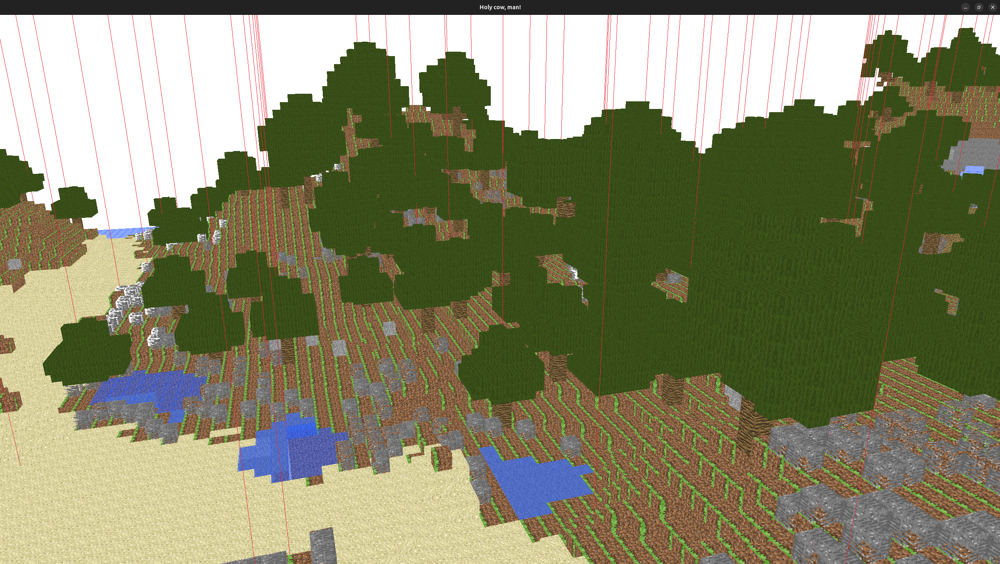

# Maincraft

Minecraft compatible client for beta 1.7.3 servers.

## Introduction

This is a project of writing a fully compatible Minecraft beta 1.7.3 client. This is not a fully minecraft clone as it doesn't contain the code necessary for singleplayer or a server, it only allows connecting to servers (although hosting a local server can be considered as singleplayer and maybe automatized to have a singleplayer mode).

## Documentation

See [the docs folder](docs/).

## Screenshots

